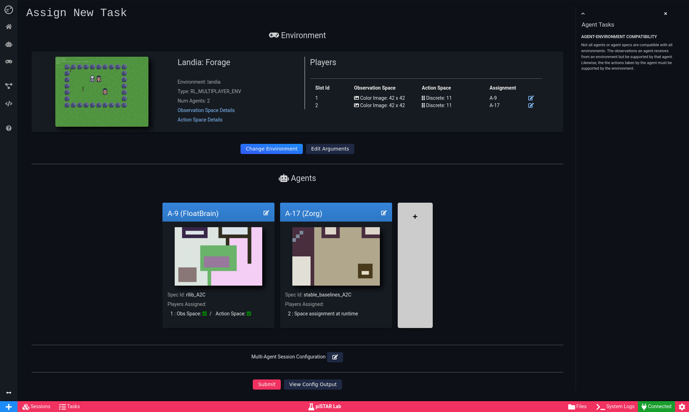

#  piSTAR Lab  

<!--   -->
 
[](https://pistarlab.readthedocs.io/en/latest/?badge=latest)

WARNING: This is an <u>**early release**</u>.

# Overview

piSTAR Lab is a modular deep reinforcement learning platform built to make AI experimentation accessible and fun.

**Documentation** https://pistarlab.readthedocs.io

## Features
* Web UI
* Extension System for adding new agents, environments or tasks types
* Python API, anthing you can do in the UI, you can do in Python as well
* Run agents in single and multi player environments
* Experiment tracking
* Uses Ray Project (https://ray.io/) under the hood for distributed processing
* Includes piSTAR [Landia](http://github.com/pistarlab/landia) a hackable Multi Agent Envrionment
* More to come

## Known Issues/Limitations
- Cluster mode is under development and not recommended at this time
- Running remotely requires SSH tunneling. All services must be running on localhost
- Mac not tested

## UI Screenshots

<br/>   <br/>

<br/>   <br/>

<br/>   <br/>

<br/>   <br/>


# Quick Start 
More detailed documentation is available at https://pistarlab.readthedocs.io

## Requirements
* Ubuntu suggested but also tested on Windows 10. We suggest using Docker for other setups.
* Python 3.7 or 3.8 (Conda is recommended)
    * [Miniconda](https://docs.conda.io/en/latest/miniconda.html) 
    * [Anaconda](https://www.anaconda.com/products/individual)
* [FFMPEG](https://www.ffmpeg.org/download.html) (Optional) 
    * Required for episode recordings
    * [Windows install instructions](https://www.wikihow.com/Install-FFmpeg-on-Windows)
* Xvfb (Optional, Ubuntu Only)
    * Helps some environments run without opening a window.
    * Useful when running piSTAR Lab remotely

## Installation
For non-standard installations see: https://pistarlab.readthedocs.io/en/latest/installation.html


### Create and Activate Conda Virtual Environment

 ```bash
conda create -n pistarlab python=3.7
conda activate pistarlab
conda install pip
 ```

### Install with pip
```
pip install https://github.com/pistarlab/pistarlab/archive/refs/heads/main.zip#egg=pistarlab[all]
```

## Usage

To launch piSTAR Lab UI, run:
```bash
pistarlab_launcher
```

Open browser to: http://localhost:7777


# Contributing

We are still in an early phase of this release but if you are interested in contributing to piSTAR Lab, please reach out.