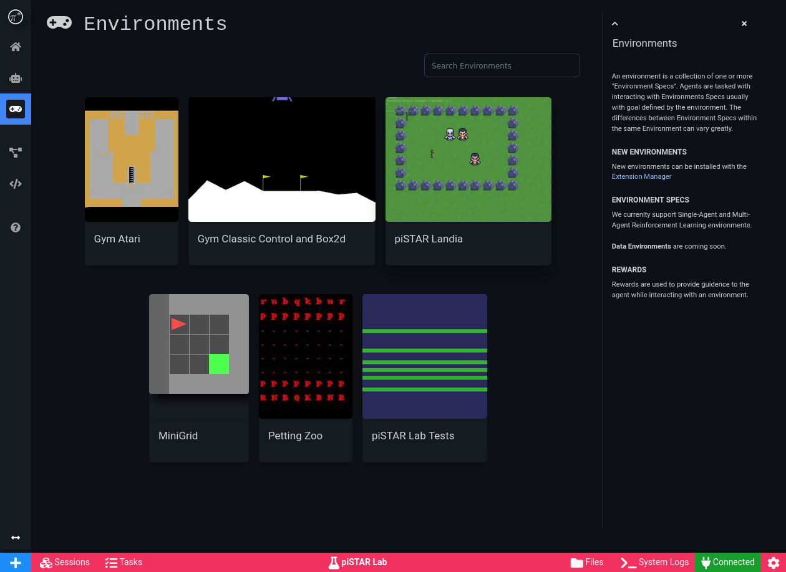

#  piSTAR Lab  

 
 
[](https://pistarlab.readthedocs.io/en/latest/?badge=latest)

WARNING: This is an <u>**early release**</u> and is not ready for public use.

# Overview

piSTAR Lab is a modular deep reinforcement learning platform built to make AI experimentation accessible and fun.

**Documentation** https://pistarlab.readthedocs.io

## Features
* Web UI
* Extension System for adding new agents, environments or tasks types
* Python API, anthing you can do in the UI, you can do in Python as well
* Run agents in single and multi player environments
* Experiment tracking
* Uses Ray Project (https://ray.io/) under the hood for distributed processing
* More to come

## Known Issues/Limitations
- Cluster mode is under development and not recommended at this time
- Running remotely requires SSH tunneling. All services must be running on localhost
- Windows and Mac not tested
- extension installation requires restarting piSTAR Lab to complete

## UI Screenshots

<br/>   <br/>


<br/>   <br/>

<br/>   <br/>


# Quick Start 
Detailed documentation is published at https://pistarlab.readthedocs.io

**Notes**
* Only tested on **Ubuntu**, but should also work on **OS X**. **MS Windows** users see [Installation using Docker](#Installation-using-Docker)
* Suggest using Anaconda or Miniconda for Python installation (visit https://www.anaconda.com/products/individual for instructions)
* Requires pip and python 3.7 or 3.8

## Installation 

### from pypi

```bash
pip install -U "pistarlab[all]"
```

### from repo 

```bash
git clone  --single-branch --depth=1 http://github.com/pistarlab/pistarlab/
pip install -e ."[all]"
```

## Usage

To launch piSTAR Lab UI, run:
```bash
pistarlab_launcher
```

Open browser to: http://localhost:7777


# Contributing

We are still in an early phase of this release but if you are interested in contributing to piSTAR Lab, please reach out.