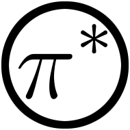

.. piSTAR Lab documentation master file, created by
   sphinx-quickstart on Tue May  4 10:08:41 2021.
   You can adapt this file completely to your liking, but it should at least
   contain the root `toctree` directive.

piSTAR Lab Documentation
==========================

|pistarlogo| piSTAR Lab is an open source platform built to make AI experimentation accessible and fun. 

* Github: http://github.com/pistarlab/pistarlab

.. note::
   piSTAR Lab is in **early development**.

Who is piSTAR Lab for?
------------------
* AI Enthusiests and Students: 
   * Have fun experimenting with state-of-the-art AI Agents. No coding required.
   * Gain a better intuition about reinforcement learning by creating your own agents.
* Reinforcement Learning Researchers and Engineers: 
   * Show case your algorithms by creating extensions for other users to enjoy. No restrictive framework/library requirements.
   * Import your externally trained agents.
   * Use piSTAR Lab in your development workflow.
   * Try your algorithm on newly available environments with just a few clicks
* Game and Environment Developers:
   * Create Extensions" which make your game playable by piSTAR Agents.
   * Train your own Agents for your game's AI

Features
--------
* Intuitive UI
* Extension System for adding new agents, environments or tasks types
* No framework requirements. Use any framework available in python (other languages coming)
* Real-time streaming of observations during training
* Single and Multi player environment support
* Experiment tracking
* Python API, anything you can do in the UI, you can do in Python as well
* Uses Ray Project (https://ray.io/) under the hood for distributed processing

Coming soon (unordered)
-----------
* Simpler installation and better support for Windows and Mac
* Easily share your trained agents with friends or publicly
* Docker based agents and environments
* Remote agents and environments
* Data environments for agents with support for learning from offline data
* API for Data Interfaces
* Support for browser based games and environments so human can interact directly with their agents.
* Support for other programming languages
* Human control mode for testing environments via the UI
* Better workspace integration with VSCode and Jupyter
* Interactive Debugger
* Testing and quality verification of extensions

Contributing
------------

piSTAR Lab is **Open Source** and welcomes your contributions.

* Donate

.. toctree::
   :hidden:

   self

.. toctree::
   :maxdepth: 2
   
   overview
   installation
   usage
   extensions
   advanced
   troubleshooting

.. toctree::
   :maxdepth: 2
   :caption: Development

   design
   development
   roadmap

.. toctree::
   :maxdepth: 2
   :caption: Package Reference

   modules
