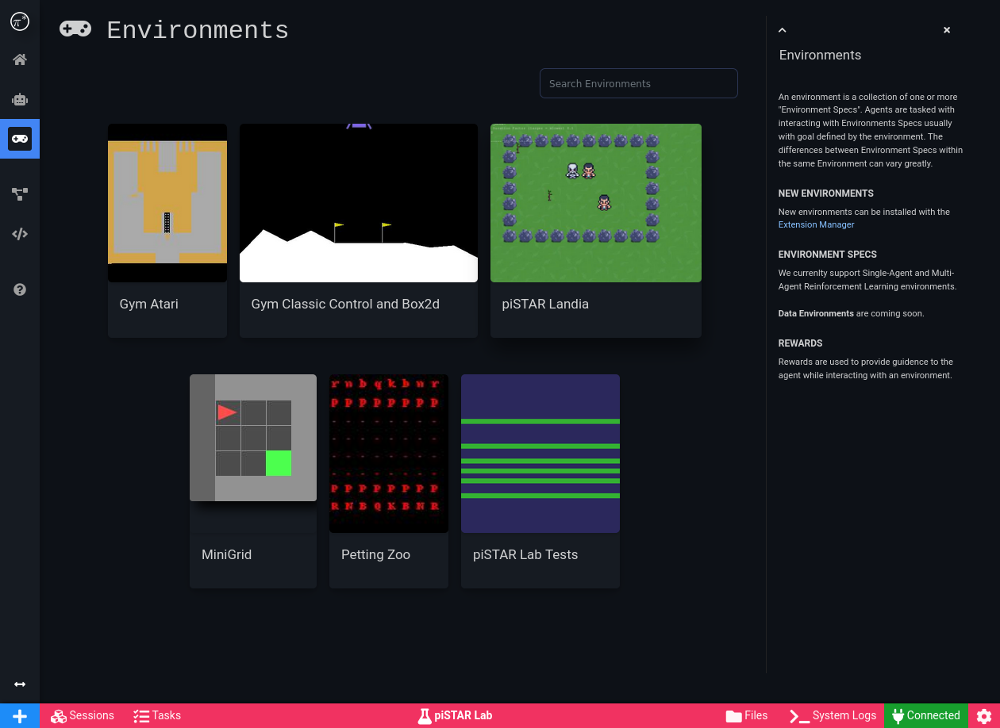
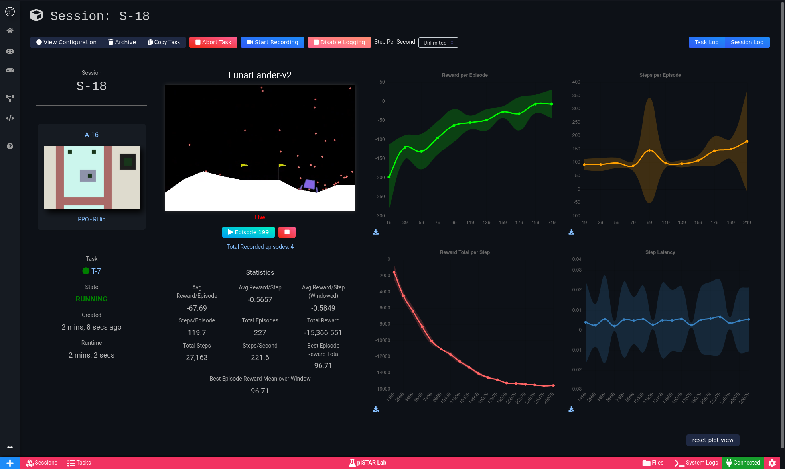
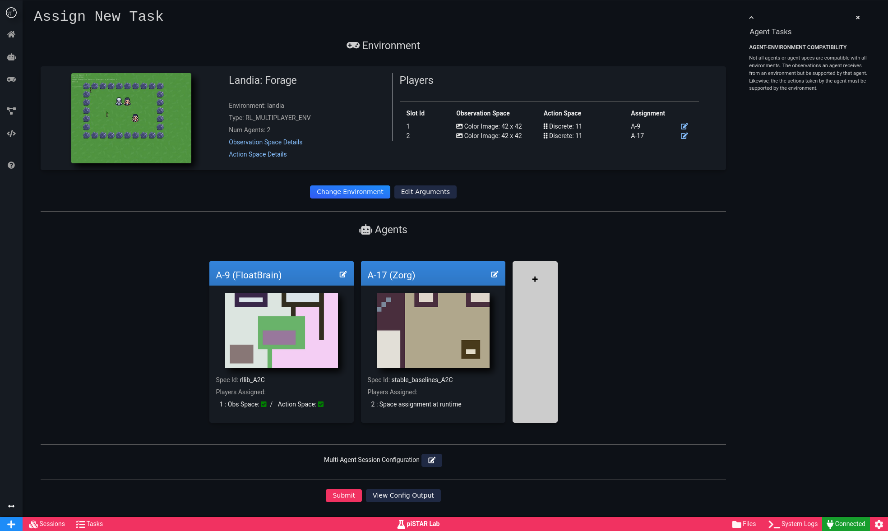
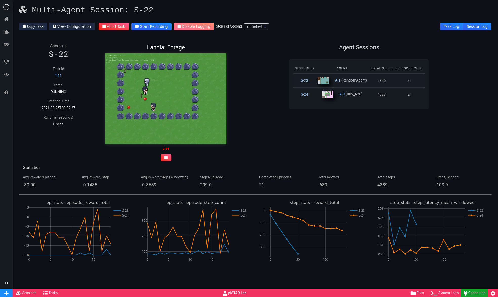
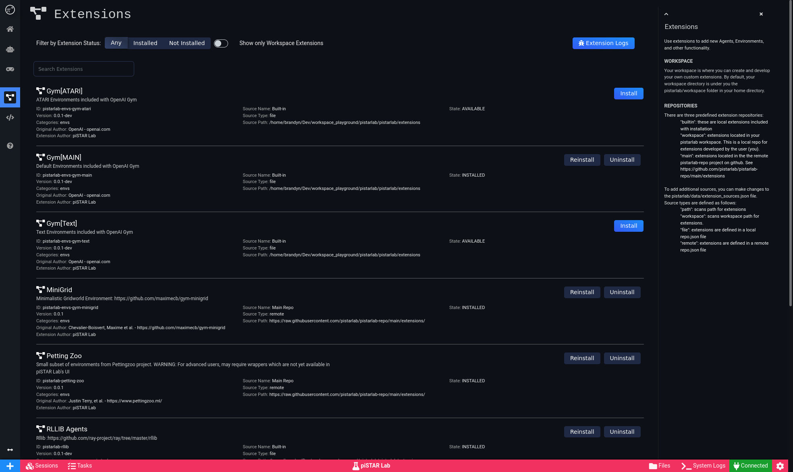

Overview
========

piSTAR Lab is modular Agent Development Environment that can run on your PC or in the cloud.

* Manage your own library of Agents and Environments.  
* Run experiments with a click of a button.  
* Watch your agent learn in realtime.

Screenshots
============

.. image:: images/recent_agents.png
    :width: 600px

